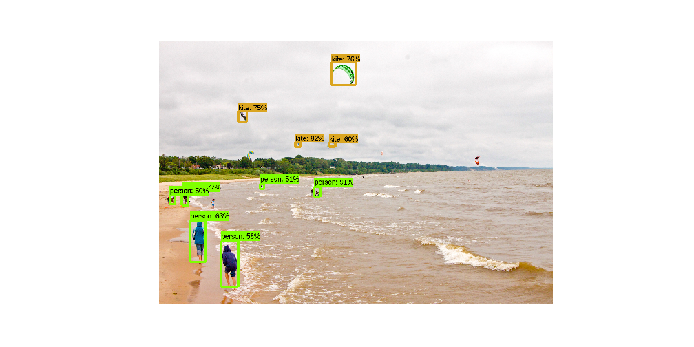
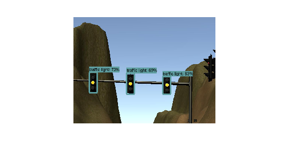

## Capstone Project: Program an Autonomous Vehicle

[](http://www.udacity.com/drive)

In this project we develop a system, using ROS nodes, to implement an autonomous vehicle. This system is tested on the [Udacity simulator](https://github.com/udacity/CarND-Capstone/releases) and will be tested on the real Udacity self-driving car (Carla) on project delivery.

Our team is composed by the following members:

|  Name		| Email Address	|
|:---------------------------------------:|:---------------------:|
| Andrei		|   ainfinum@gmail.com			|
| Yan Wu		|   ianwu521@gmail.com			|
| Ian Wang 	|   ian.immortal@gmail.com		|
| Jean-Yves	|   jybourdon@hotmail.fr			|
| Jose Horas	|   jose.horas@gmail.com			|

### Overview

In order to complete the project we program in Python the different ROS nodes. The basic structure is well described in the Udacity Walkthrough, and our implementations follows the given guidelines. This implements the basic functionality of loading the Waypoints that the car has to follow, controlling the car movement along these Waypoints, and stop the car upon encountering a red traffic light. The details of the ROS system is described in [System architecture](#system-architecture).

After laying out the basic ROS functionality, much focus was given to implement the traffic light detection from images collected by the camera, both on the simulator and on the real testing lot. We decided in favor to use a Tensorflow model pre-trained on the general task of object detection. To prepare for this part of the project we read the previous work of [Alex Lechner](https://github.com/alex-lechner/Traffic-Light-Classification) on the Udacity Nanodegree, as well as the Medium post of [Vatsal Srivastava](https://becominghuman.ai/traffic-light-detection-tensorflow-api-c75fdbadac62). We also used their datasets for test and validation.

To fine-tune this model to our task of recognizing traffic lights (red, yellow, and green) we generated thousands of labeled training images. 

The training on those images was done using the Tensorflow Object Detection API and Google Cloud Platform, as described in [Traffic Light Classifier](#traffic-light-classifier).

The integration of our Tensorflow Traffic Light Classifier into the ROS system is described in [Final Integration](#final-integration).

### System Architecture

The ROS system can be divided in three main subsystems:

- **Perception:** detects traffic lights and classifies them into red, yellow, green, or unknown
- **Planning:** loads the circuit waypoints and update the waypoint list in front of our car
- **Control:** makes the car to actually move along the waypoints by controlling the car's throttle, steer, and brake using PID controller and low pass filter

The diagram below shows the subsystem division, as well as the ROS nodes and topics.

- nodes: are single process within the ROS graph. The main nodes that we worked on, or completed from the Udacity repository, were:
	- **tl_detector:** in the perception subsystem.
	- **waypoint_updater:** in the planning subsystem
	- **dbw_node:** in the control subsystem
- topics: are named buses over which nodes send and receive messages, by subscribing or publishing to them.

 

#### Perception (tl_detector.py)

This node subscribes to four topics:
- `/base_waypoints`: provides the complete list of waypoints for the course.
- `/current_pose`: determines the vehicle's location.
- `/image_color`: provides an image stream from the car's camera. 
- `/vehicle/traffic_lights`: provides the (x, y, z) coordinates of all traffic lights.

This node will find the waypoint of the closest traffic light in front of the car. This point will be described by its index counted from the car (e.g.: the number 12 waypoint ahead of the car position). Then, the state of the traffic light will be acquired from the camera image in `/image_color` using the classifier implementation in `tl_classifier.py`. If the traffic light is red, it will publish the waypoint index into the `/traffic_waypoint` topic. This information will be taken by the Planning subsystem to define the desired velocity at the next sequence of waypoints.

#### Planning (waypoint_updater.py)

This node subscribes to the topics:
- `/base_waypoints`: list of all waypoints for the track
- `/current_pose`: the current position coordinates of our car
- `/traffic_waypoint`: waypoint list of the traffic light in our circuit

It publishes a list of waypoints in front of our car to the topic `/final_waypoints`. The data in waypoints also includes the desired velocity of the car at the given waypoint. If a red traffic light is detected in front of the car, we modify the desired velocity of the `/final_waypoints` up to it in a way that the car slowly stops at the right place.

The number of waypoints is defined by the parameter `LOOKAHEAD_WPS`. If this parameter is too big, there is a big latency updating the waypoints, in a way that the car gets ahead of the list of way points. This confuses the control of the car, which tries to follow the waypoints. We set for a value of 20, to get rid of this latency while still having enough data to properly control the car.

#### Control (dbw_node.py)

In the control subsystem, Udacity provides an Autoware software `waypoint_follower.py`. After publishing `/final_waypoints` this software publishes twist commands to the `/twist_cmd` topic, that contain the desired linear and angular velocities.

`dbw_node.py` subscribes to `/twist_cmd`, `/current_velocity`, and `/vehicle/dbw_enabled`. It passes the messages in these nodes to the `Controller` class from `twist_controller.py`. We implemented here the control of the car, using the provided Yaw Controller, PID Controller, and LowPass Filter.

It is important to perfom the control only when `/vehicle/dbw_enabled` is true. When this topic message is false, it means the car is on manual control. In this condition the PID controller would mistakenly accumulate error.

The calculated throttle, brake, and steering are published to the topics:
- `/vehicle/throttle_cmd`
- `/vehicle/brake_cmd`
- `/vehicle/steering_cmd`

### Traffic Light Classifier

The state of the traffic light in front of the car has to be extracted from the camera's images, both on the simulator and at the real site. Different methods of image recognition can be used. We decided to use Deep Learning in the form of a model pre-trained on the general task of object detection. While previously, in this Udacity nanodegree, we defined a model from scratch and trained it for traffic sign classification, object detection also includes the capability of locating an object within an image and delimiting its position on a bounding box. Only this way can we extract from the camera image the state of one or several traffic light within the landscape in front of us.

Several Deep Learning methods for [object detection](https://en.wikipedia.org/wiki/Object_detection) have been developed by researchers. Two of the most popular methods are [R-CNN](https://arxiv.org/abs/1311.2524) (Regions with CNN), and [SSD](https://arxiv.org/abs/1512.02325) (Single Shot Detector). While R-CNN performs with higher accuracy than SSD, the latter is faster. Improved versions have been developed (Fast R-CNN, Faster R-CNN) but they are still slower than SSD.

The Google's [Tensorflow Object Detection API](https://github.com/tensorflow/models/tree/master/research/object_detection) provides a great framework to implement our traffic light classifier. This is a collection of pre-trained models and high level subroutines that facilitate the use and fine-tuning of these models. The models are compiled in [Tensorflow detection model zoo](https://github.com/tensorflow/models/blob/master/research/object_detection/g3doc/detection_model_zoo.md), belonging mainly to the SSD and Faster R-CNN methods.

Although the goal of the API is to facilitate the fine-tune training of these model, there are still a lot of installation and configuration steps that are not trivial at all. Actually, by the time you have fully trained a model for your purposes you will have gone through a convoluted series of steps, and probably several errors. There is extensive information on the [API Readme](https://github.com/tensorflow/models/blob/master/research/object_detection/README.md). However, this information is general and in some parts lacks detail for our concrete task. So, we find useful to include belowa detailed tutorial describing our experience

On a high level, the steps to take are:
- [Tensorflow Object Detection API Installation](#tensorflow-object-detection-api-installation)
- [Choose a model from the Model Zoo](#choose-a-model-from-the-model-zoo)
- Configure the pipeline.config file
- Test the training process locally
- Train with GPUs using Google Cloud Platform (GCP)
- Export the final graph

#### Tensorflow Object Detection API Installation

  (You find the official reference here: [Installation](https://github.com/tensorflow/models/blob/master/research/object_detection/g3doc/installation.md))

1. Install TensorFlow:

	```pip install tensorflow```

2. Install required libraries:
	```
	sudo apt-get install protobuf-compiler python-pil python-lxml python-tk
	pip install --user Cython
	pip install --user contextlib2
	pip install --user jupyter
	pip install --user matplotlib
	```

3. Create a new directory ``tensorflow``

4. Clone the entire [models GitHub repository](https://github.com/tensorflow/models) from the``tensorflow`` directory. 

	```git clone https://github.com/tensorflow/models.git```
	
	This will take 1.2 GB on disk, as it contains models for many different tasks (NLP, GAN, ResNet...). Our model is found in `/tensorflow/models/research/object_detection/`, and many of the commands below will be input from `/tensorflow/models/research/

5. Install COCO API
	```
	# From tensorflow/models/research/
	git clone https://github.com/cocodataset/cocoapi.git
	cd cocoapi/PythonAPI
	make
	cp -r pycocotools <path_to_tensorflow>/models/research/
	```

6. Compile Protobuf
	```
	# From tensorflow/models/research/
	protoc object_detection/protos/*.proto --python_out=.
	```
	
7. Add libraries to PYTHONPATH
	```
	# From tensorflow/models/research/
	export PYTHONPATH=$PYTHONPATH:`pwd`:`pwd`/slim
	```

8. If you run without errors until here, test your installation with 
	```
	python object_detection/builders/model_builder_test.py
	```

Once installed, the API provides the following tools and scripts that we will use to fine-tune a model with our data:

- An inference script in the form of a Jupyter Notebook, to detect objects on an image from a "frozen_inference_graph.pb" ([Object Detection Demo](https://github.com/tensorflow/models/blob/master/research/object_detection/object_detection_tutorial.ipynb))
- Tools to create TFRecord files from original data ([dataset tools](https://github.com/tensorflow/models/tree/master/research/object_detection/dataset_tools))
- A training script to fine-tune a pre-trained model with our own dataset, locally or in Google Cloud ([model_main.py](https://github.com/tensorflow/models/blob/master/research/object_detection/model_main.py))
- A script to export a new "frozen_inference_graph.pb" from a fine-tuned model ([export_inference_graph.py](https://github.com/tensorflow/models/blob/master/research/object_detection/export_inference_graph.py))


#### Choose and test a model from the Model Zoo
(You find the official reference here: [Tensorflow detection model zoo](https://github.com/tensorflow/models/blob/master/research/object_detection/g3doc/detection_model_zoo.md))

In the model zoo you find a list of pre-trained models to download, as well as some basic stats regarding accuracy and speed. These models are pre-trained with datasets like the [COCO dataset](http://cocodataset.org/#home) or the [Open Images dataset](https://storage.googleapis.com/openimages/web/index.html). The COCO dataset, for example, consists of more than 200K images, with 1.5 object instances labeled within them, belonging to 80 different object categories.

Each pre-trained model contains:
- a checkpoint (`model.ckpt.data-00000-of-00001`, `model.ckpt.index`, `model.ckpt.meta`)
- a frozen graph (`frozen_inference_graph.pb`) to be used for out of the box inference 
- a config file (`pipeline.config`) 

The pre-trained model can already be tested for inference. As it is not fine-tuned for our requirements (detect traffic lights and classify them into red, yellow, or green), the results will not be satisfactory for us. However is a good exercise to get familiarized with the inference script in the [Object Detection Demo](https://github.com/tensorflow/models/blob/master/research/object_detection/object_detection_tutorial.ipynb) Jupyter notebook. This notebook downloads the model automatically for you. If you download it manually to a directory of your choice, as you will need to work with it when fine-tuning, you can comment out the lines in the "Download Model" section and input the correct local path in
```
PATH_TO_FROZEN_GRAPH = MODEL_NAME + '/frozen_inference_graph.pb'
```

As it happens that the COCO dataset includes "Traffic Light" as an object category, when we run the inference script with one of our images, this class will probably be recognized. However, the model as it is will not be able to classify the traffic light state. Below you can see the result on a general picture and on one of our pictures out of the simulator.

A|B
:-:|:-:
 |  

A|B
:-:|:-:
 | 

---

The flow to get all this going includes:

- Clone and install tensorflow/models ([Installation](https://github.com/tensorflow/models/blob/master/research/object_detection/g3doc/installation.md))
- Try out the tutorial notebook with an off-the-shelf model ([Quick Start: Jupyter notebook for off-the-shelf inference](https://github.com/tensorflow/models/blob/master/research/object_detection/object_detection_tutorial.ipynb))
- Get our own data into TFRecord files ([Preparing inputs](https://github.com/tensorflow/models/blob/master/research/object_detection/g3doc/preparing_inputs.md))
- Get the pre-trained model we want to use ([Tensorflow detection model zoo](https://github.com/tensorflow/models/blob/master/research/object_detection/g3doc/detection_model_zoo.md))
- Modify the pipeline.config file to describe our setup ([Configuring an object detection pipeline](https://github.com/tensorflow/models/blob/master/research/object_detection/g3doc/configuring_jobs.md))
- Run model_main.py locally: ([Running locally](https://github.com/tensorflow/models/blob/master/research/object_detection/g3doc/running_locally.md))
	- Test with a few train steps just to quickly check everything is working
	- Export for inference
	- Try on the tutorial notebook
- Run model_main.py on Google Cloud Platform (GCP) ([Running on the cloud](https://github.com/tensorflow/models/blob/master/research/object_detection/g3doc/running_on_cloud.md)):
	- Get a Google Cloud account, setup a project and a bucket ([Getting Started](https://cloud.google.com/ml-engine/docs/tensorflow/getting-started-training-prediction))
	- Install google-cloud-sdk locally ([SDK documentation](https://cloud.google.com/sdk/docs/))
	- Upload model and data to the bucket, modifying pipeline.config to GCP setup
	- Package our local tools to send and run on GCP
	- Create YAML file
	- Run script on GCP (~ 1.5 hours for train_steps=50000) 
	- Download new model
	- Export for inference
	- Try on the tutorial notebook


---

---


This is the project repo for the final project of the Udacity Self-Driving Car Nanodegree: Programming a Real Self-Driving Car. For more information about the project, see the project introduction [here](https://classroom.udacity.com/nanodegrees/nd013/parts/6047fe34-d93c-4f50-8336-b70ef10cb4b2/modules/e1a23b06-329a-4684-a717-ad476f0d8dff/lessons/462c933d-9f24-42d3-8bdc-a08a5fc866e4/concepts/5ab4b122-83e6-436d-850f-9f4d26627fd9).

Please use **one** of the two installation options, either native **or** docker installation.

### Native Installation

* Be sure that your workstation is running Ubuntu 16.04 Xenial Xerus or Ubuntu 14.04 Trusty Tahir. [Ubuntu downloads can be found here](https://www.ubuntu.com/download/desktop).
* If using a Virtual Machine to install Ubuntu, use the following configuration as minimum:
  * 2 CPU
  * 2 GB system memory
  * 25 GB of free hard drive space

  The Udacity provided virtual machine has ROS and Dataspeed DBW already installed, so you can skip the next two steps if you are using this.

* Follow these instructions to install ROS
  * [ROS Kinetic](http://wiki.ros.org/kinetic/Installation/Ubuntu) if you have Ubuntu 16.04.
  * [ROS Indigo](http://wiki.ros.org/indigo/Installation/Ubuntu) if you have Ubuntu 14.04.
* [Dataspeed DBW](https://bitbucket.org/DataspeedInc/dbw_mkz_ros)
  * Use this option to install the SDK on a workstation that already has ROS installed: [One Line SDK Install (binary)](https://bitbucket.org/DataspeedInc/dbw_mkz_ros/src/81e63fcc335d7b64139d7482017d6a97b405e250/ROS_SETUP.md?fileviewer=file-view-default)
* Download the [Udacity Simulator](https://github.com/udacity/CarND-Capstone/releases).

### Docker Installation
[Install Docker](https://docs.docker.com/engine/installation/)

Build the docker container
```bash
docker build . -t capstone
```

Run the docker file
```bash
docker run -p 4567:4567 -v $PWD:/capstone -v /tmp/log:/root/.ros/ --rm -it capstone
```

### Port Forwarding
To set up port forwarding, please refer to the "uWebSocketIO Starter Guide" found in the classroom (see Extended Kalman Filter Project lesson).

### Usage

1. Clone the project repository
```bash
git clone https://github.com/udacity/CarND-Capstone.git
```

2. Install python dependencies
```bash
cd CarND-Capstone
pip install -r requirements.txt
```
3. Make and run styx
```bash
cd ros
catkin_make
source devel/setup.sh
roslaunch launch/styx.launch
```
4. Run the simulator

### Real world testing
1. Download [training bag](https://s3-us-west-1.amazonaws.com/udacity-selfdrivingcar/traffic_light_bag_file.zip) that was recorded on the Udacity self-driving car.
2. Unzip the file
```bash
unzip traffic_light_bag_file.zip
```
3. Play the bag file
```bash
rosbag play -l traffic_light_bag_file/traffic_light_training.bag
```
4. Launch your project in site mode
```bash
cd CarND-Capstone/ros
roslaunch launch/site.launch
```
5. Confirm that traffic light detection works on real life images

### Other library/driver information
Outside of `requirements.txt`, here is information on other driver/library versions used in the simulator and Carla:

Specific to these libraries, the simulator grader and Carla use the following:

|        | Simulator | Carla  |
| :-----------: |:-------------:| :-----:|
| Nvidia driver | 384.130 | 384.130 |
| CUDA | 8.0.61 | 8.0.61 |
| cuDNN | 6.0.21 | 6.0.21 |
| TensorRT | N/A | N/A |
| OpenCV | 3.2.0-dev | 2.4.8 |
| OpenMP | N/A | N/A |

We are working on a fix to line up the OpenCV versions between the two.
