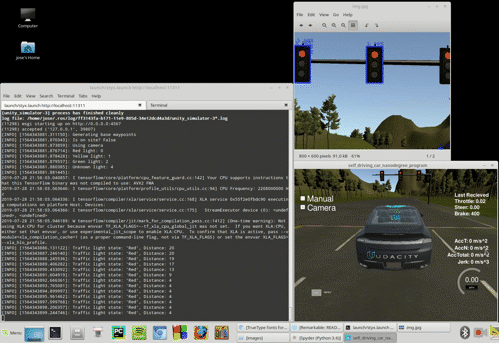
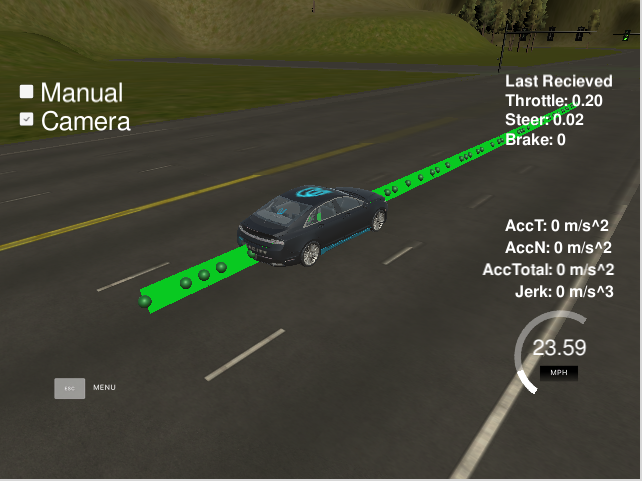
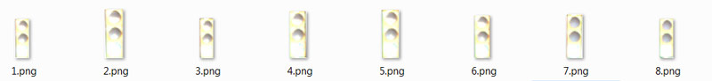
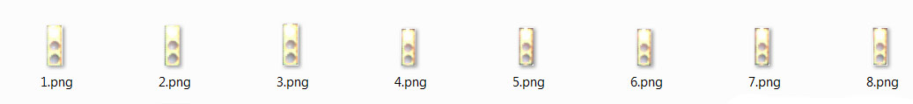
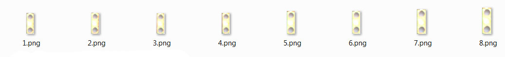
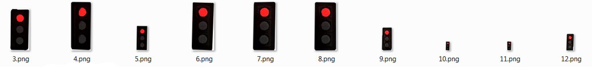
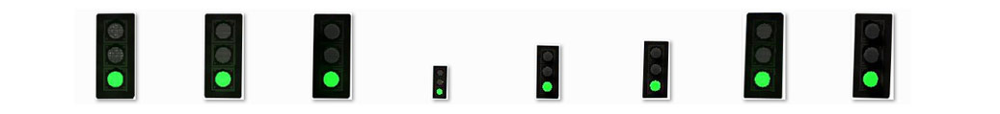
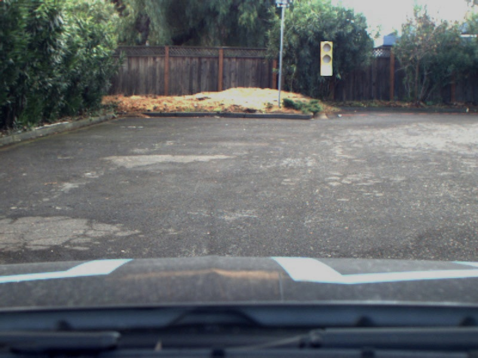
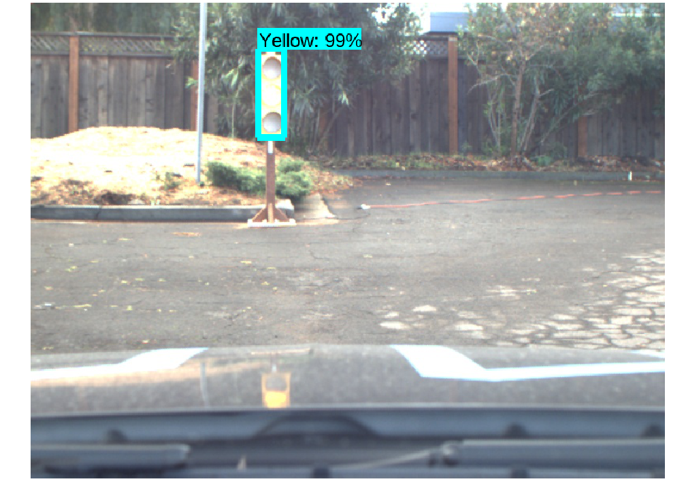
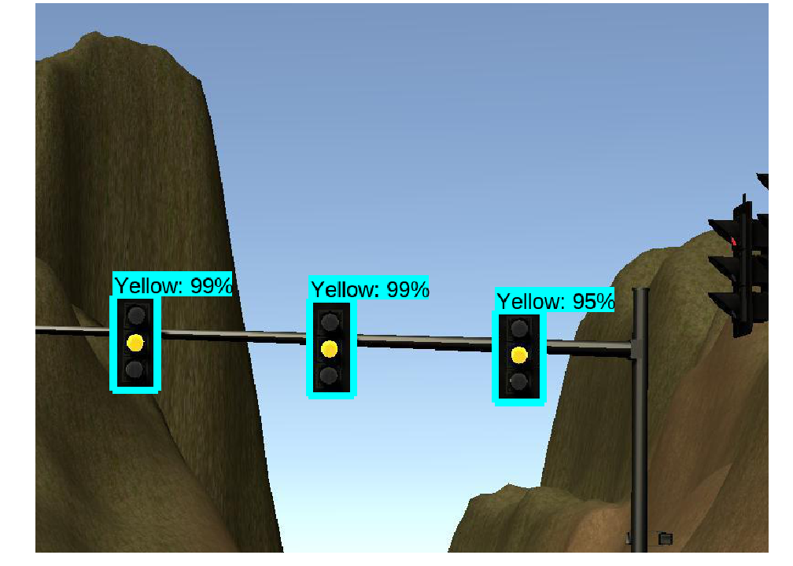

# Capstone Project: Program an Autonomous Vehicle

[](http://www.udacity.com/drive)

In this project we develop a system, using ROS nodes, to implement an autonomous vehicle. Our car will follow the designated waypoints along a road, recognizes the traffic light status from camera images, stop on red and restart driving on green. This system is tested on the [Udacity simulator](https://github.com/udacity/CarND-Capstone/releases) and will be tested on the real Udacity self-driving car (Carla) on project delivery.

## Members of Team **"Always straight to the point!"**

|  Name		| Email Address	|
|:---------------------------------------:|:---------------------:|
| Andrei		|   ainfinum@gmail.com			|
| Yan Wu		|   ianwu521@gmail.com			|
| Ian Wang 	|   ian.immortal@gmail.com		|
| Jean-Yves	|   jybourdon@hotmail.fr			|
| Jose Horas<br>(team lead)	|   jose.horas@gmail.com			|

---

<p align="center">

</p>

---

## Table of Contents

1. [Overview](#1-overview)
2. [Workaround to avoid simulator latency issue with camera on](#2-workaround-to-avoid-simulator-latency-issue-with-camera-on)
3. [ROS System Architecture](#3-ros-system-architecture)
	1. [Perception (tl_detector.py)](#i-perception-tl_detectorpy)
	2. [Planning (waypoint_updater.py)](#ii-planning-waypoint_updaterpy)
	3. [Control (dbw_node.py)](#iii-control-dbw_nodepy)
4. [Datasets](#4-datasets)
5. [Traffic Light Classifier](#5-traffic-light-classifier)
	1. [Tensorflow Object Detection API Installation](#i-tensorflow-object-detection-api-installation)
	2. [Choose and test a model from the Model Zoo](#ii-choose-and-test-a-model-from-the-model-zoo)
	3. [Configure the pipeline.config file](#iii-configure-the-pipelineconfig-file)
	4. [Test the training process locally](#iv-test-the-training-process-locally)
	5. [Train with GPUs using Google Cloud Platform (GCP)](#v-train-with-gpus-using-google-cloud-platform-gcp)
	6. [Export and test the final graph](#vi-export-and-test-the-final-graph)
6. [Final Integration](#6-final-integration)
	1. [Model Evaluation](#i-model-evaluation)

## 1. Overview

In order to complete the project we program in Python the different ROS nodes. The basic structure is well described in the Udacity Walkthrough, and our implementations follows the given guidelines. This implements the basic functionality of loading the Waypoints that the car has to follow, controlling the car movement along these Waypoints, and stop the car upon encountering a red traffic light. The details of the ROS system is described in [System architecture](#system-architecture).

After laying out the basic ROS functionality, much focus was given to implement the traffic light detection from images collected by the camera, both on the simulator and on the real testing lot. We decided in favor to use a Tensorflow model pre-trained on the general task of object detection. To prepare for this part of the project we read the previous work of [Alex Lechner](https://github.com/alex-lechner/Traffic-Light-Classification) on the Udacity Nanodegree, as well as the Medium post of [Vatsal Srivastava](https://becominghuman.ai/traffic-light-detection-tensorflow-api-c75fdbadac62). We also used their datasets for test and validation.

To fine-tune this model to our task of recognizing traffic lights (red, yellow, and green) we generated thousands of labeled training images. This process is described in [Datasets](#4-datasets)

The training on those images was done using the Tensorflow Object Detection API and Google Cloud Platform, as described in [Traffic Light Classifier](#5-traffic-light-classifier).

The integration of our Tensorflow Traffic Light Classifier into the ROS system is described in [Final Integration](#6-final-integration).

However, before getting into the details we describe a workaround we needed to use to finish our tests satisfactorily, and solve a latency problem in the simulator when the camera is switched on.

## 2. Workaround to avoid simulator latency issue with camera on

After implementing the basic ROS functionality the car can complete a full lap in the simulator without issues. However, to fully implement the traffic light recognition with a classifier we need to activate the camera in the simulator. With this the simulator begins to send images data to the `/image_color` topic. This data processing seems to overload our system, and a latency appears delaying the updating of the waypoints relative to the position of our car. The waypoints begin to appear on the back of the car and, as the car tries to follow these waypoints, the control subsytem get erratic and the car drives off the road.

We found this problem both in the virtual machine as in a native Linux installation. It is also observed by many Udacity Nanodegree participants, as seen in these GitHub issues: [Capstone Simulator Latency #210](https://github.com/udacity/CarND-Capstone/issues/210) and [turning on the camera slows car down so auto-mode gets messed up #266](https://github.com/udacity/CarND-Capstone/issues/266). An example of the issue at our side is shown below:

<p align="center">

</p>

We implemented a workaround by a little modification in one of the files provided by Udacity in the ROS System, `bridge.py`. This module builds the node `styx_server`, that creates the topics responsible to transmit different data out of the simulator. We tried first to only process some of the images received via `/image_color` but it seemed the origin of the delay was the presence of these images in the topic in the first place. Thus, we implemented the skipping logic in the topic itself, and the issue got finally solved. The code modifies the `publish_camera()` function:
```
    def publish_camera(self, data):
        if self.image_gap >= 3:
            self.image_gap = 0
            imgString = data["image"]
            image = PIL_Image.open(BytesIO(base64.b64decode(imgString)))
            image_array = np.asarray(image)
    
            image_message = self.bridge.cv2_to_imgmsg(image_array, encoding="rgb8")
            self.publishers['image'].publish(image_message)
        else:
            self.image_gap += 1
```

Furthermore, the waypoints queue was reduced from 200 to 20, which also proved to speed up the simulator considerably before implementing this workaround. 

However, this method only allowed us to get rid of the latency in a native Linux installation. On a Virtual Machine under Windows and on the Ucacity Web Workspace, the latency got better, maybe with increased values of skipped frames, but still showed after some time.

## 3. ROS System Architecture

The ROS system can be divided in three main subsystems:

- **Perception:** detects traffic lights and classifies them into red, yellow, green, or unknown
- **Planning:** loads the circuit waypoints and update the waypoint list in front of our car
- **Control:** makes the car to actually move along the waypoints by controlling the car's throttle, steer, and brake using PID controller and low pass filter

The diagram below shows the subsystem division, as well as the ROS nodes and topics.

- nodes: are single process within the ROS graph. The main nodes that we worked on, or completed from the Udacity repository, were:
	- **tl_detector:** in the perception subsystem.
	- **waypoint_updater:** in the planning subsystem
	- **dbw_node:** in the control subsystem
- topics: are named buses over which nodes send and receive messages, by subscribing or publishing to them.

 

### i. Perception (tl_detector.py)

This node subscribes to four topics:
- `/base_waypoints`: provides the complete list of waypoints for the course.
- `/current_pose`: determines the vehicle's location.
- `/image_color`: provides an image stream from the car's camera. 
- `/vehicle/traffic_lights`: provides the (x, y, z) coordinates of all traffic lights.

This node will find the waypoint of the closest traffic light in front of the car. This point will be described by its index counted from the car (e.g.: the number 12 waypoint ahead of the car position). Then, the state of the traffic light will be acquired from the camera image in `/image_color` using the classifier implementation in `tl_classifier.py`. If the traffic light is red, it will publish the waypoint index into the `/traffic_waypoint` topic. This information will be taken by the Planning subsystem to define the desired velocity at the next sequence of waypoints.

### ii. Planning (waypoint_updater.py)

This node subscribes to the topics:
- `/base_waypoints`: list of all waypoints for the track
- `/current_pose`: the current position coordinates of our car
- `/traffic_waypoint`: waypoint list of the traffic light in our circuit

It publishes a list of waypoints in front of our car to the topic `/final_waypoints`. The data in waypoints also includes the desired velocity of the car at the given waypoint. If a red traffic light is detected in front of the car, we modify the desired velocity of the `/final_waypoints` up to it in a way that the car slowly stops at the right place.

The number of waypoints is defined by the parameter `LOOKAHEAD_WPS`. If this parameter is too big, there is a big latency updating the waypoints, in a way that the car gets ahead of the list of way points. This confuses the control of the car, which tries to follow the waypoints. We set for a value of 20, to get rid of this latency while still having enough data to properly control the car.

### iii. Control (dbw_node.py)

In the control subsystem, Udacity provides an [Autoware](https://www.autoware.org/) software `waypoint_follower.py`. After publishing `/final_waypoints` this software publishes twist commands to the `/twist_cmd` topic, that contain the desired linear and angular velocities.

`dbw_node.py` subscribes to `/twist_cmd`, `/current_velocity`, and `/vehicle/dbw_enabled`. It passes the messages in these nodes to the `Controller` class from `twist_controller.py`. We implemented here the control of the car, using the provided Yaw Controller, PID Controller, and LowPass Filter.

It is important to perfom the control only when `/vehicle/dbw_enabled` is true. When this topic message is false, it means the car is on manual control. In this condition the PID controller would mistakenly accumulate error.

The calculated throttle, brake, and steering are published to the topics:
- `/vehicle/throttle_cmd`
- `/vehicle/brake_cmd`
- `/vehicle/steering_cmd`

## 4. Datasets

After we got our dataset of images from the simulator and rosbag we started to think how to label it. The first option was label it by hand but when we look into the number of collected images (more than 1k) we decided that it’s not a good way as we have other work to do 😊

We decided to generate a dataset. We cut by 10-15 traffic lights of each color.







Using OpenCV generate thousands of images by resizing traffic lights, changing contrast and brightness. As every traffic light was applied on a background by our script we could generate coordinates of drawn bounding boxes as well.





 
TFRecord file was created on the fly by packing all our info into TF format using tensorflow function tf.train.Example

## 5. Traffic Light Classifier

The state of the traffic light in front of the car has to be extracted from the camera's images, both on the simulator and at the real site. Different methods of image recognition can be used. We decided to use Deep Learning in the form of a model pre-trained on the general task of object detection. While previously, in this Udacity nanodegree, we defined a model from scratch and trained it for traffic sign classification, object detection also includes the capability of locating an object within an image and delimiting its position on a bounding box. Only this way can we extract from the camera image the state of one or several traffic light within the landscape in front of us.

Several Deep Learning methods for [object detection](https://en.wikipedia.org/wiki/Object_detection) have been developed by researchers. Two of the most popular methods are [R-CNN](https://arxiv.org/abs/1311.2524) (Regions with CNN), and [SSD](https://arxiv.org/abs/1512.02325) (Single Shot Detector). While R-CNN performs with higher accuracy than SSD, the latter is faster. Improved versions have been developed (Fast R-CNN, Faster R-CNN) but they are still slower than SSD.

The Google's [Tensorflow Object Detection API](https://github.com/tensorflow/models/tree/master/research/object_detection) provides a great framework to implement our traffic light classifier. This is a collection of pre-trained models and high level subroutines that facilitate the use and fine-tuning of these models. The models are compiled in [Tensorflow detection model zoo](https://github.com/tensorflow/models/blob/master/research/object_detection/g3doc/detection_model_zoo.md), belonging mainly to the SSD and Faster R-CNN methods.

Although the goal of the API is to facilitate the fine-tune training of these model, there are still a lot of installation and configuration steps that are not trivial at all. Actually, by the time you have fully trained a model for your purposes you will have gone through a convoluted series of steps, and probably several errors. There is extensive information on the [API Readme](https://github.com/tensorflow/models/blob/master/research/object_detection/README.md). However, this information is general and in some parts lacks detail for our concrete task. So, we find useful to include below a detailed tutorial describing our experience

On a high level, the steps to take are:
- [i. Tensorflow Object Detection API Installation](#i-tensorflow-object-detection-api-installation)
- [ii. Choose and test a model from the Model Zoo](#ii-choose-and-test-a-model-from-the-model-zoo)
- [iii. Configure the pipeline.config file](#iii-configure-the-pipelineconfig-file)
- [iv. Test the training process locally](#iv-test-the-training-process-locally)
- [v. Train with GPUs using Google Cloud Platform (GCP)](#v-train-with-gpus-using-google-cloud-platform-gcp)
- [vi. Export and test the final graph](#vi-export-and-test-the-final-graph)

### i. Tensorflow Object Detection API Installation

  (You find the [official reference](https://github.com/tensorflow/models/blob/master/research/object_detection/g3doc/installation.md) here)

1. Install TensorFlow:

	```pip install tensorflow```

2. Install required libraries:
	```
	sudo apt-get install protobuf-compiler python-pil python-lxml python-tk
	pip install --user Cython
	pip install --user contextlib2
	pip install --user jupyter
	pip install --user matplotlib
	```

3. Create a new directory ``tensorflow``

4. Clone the entire [models GitHub repository](https://github.com/tensorflow/models) from the``tensorflow`` directory. 

	```git clone https://github.com/tensorflow/models.git```
	
	This will take 1.2 GB on disk, as it contains models for many different tasks (NLP, GAN, ResNet...). Our model is found in `/tensorflow/models/research/object_detection/`, and many of the commands below will be input from `/tensorflow/models/research/

5. Install COCO API
	```
	# From tensorflow/models/research/
	git clone https://github.com/cocodataset/cocoapi.git
	cd cocoapi/PythonAPI
	make
	cp -r pycocotools <path_to_tensorflow>/models/research/
	```

6. Compile Protobuf
	```
	# From tensorflow/models/research/
	protoc object_detection/protos/*.proto --python_out=.
	```
	
7. Add libraries to PYTHONPATH
	```
	# From tensorflow/models/research/
	export PYTHONPATH=$PYTHONPATH:`pwd`:`pwd`/slim
	```

8. If you run without errors until here, test your installation with 
	```
	python object_detection/builders/model_builder_test.py
	```

Once installed, the API provides the following tools and scripts that we will use to fine-tune a model with our data:

- An inference script in the form of a Jupyter Notebook, to detect objects on an image from a "frozen_inference_graph.pb" ([Object Detection Demo](https://github.com/tensorflow/models/blob/master/research/object_detection/object_detection_tutorial.ipynb))
- Tools to create TFRecord files from original data ([dataset tools](https://github.com/tensorflow/models/tree/master/research/object_detection/dataset_tools))
- A training script to fine-tune a pre-trained model with our own dataset, locally or in Google Cloud ([model_main.py](https://github.com/tensorflow/models/blob/master/research/object_detection/model_main.py))
- A script to export a new "frozen_inference_graph.pb" from a fine-tuned model ([export_inference_graph.py](https://github.com/tensorflow/models/blob/master/research/object_detection/export_inference_graph.py))


### ii. Choose and test a model from the Model Zoo
(You find the [official reference](https://github.com/tensorflow/models/blob/master/research/object_detection/g3doc/detection_model_zoo.md) here)

In the model zoo you find a list of pre-trained models to download, as well as some basic stats regarding accuracy and speed. These models are pre-trained with datasets like the [COCO dataset](http://cocodataset.org/#home) or the [Open Images dataset](https://storage.googleapis.com/openimages/web/index.html). The COCO dataset, for example, consists of more than 200K images, with 1.5 object instances labeled within them, belonging to 80 different object categories.

Each pre-trained model contains:
- a checkpoint (`model.ckpt.data-00000-of-00001`, `model.ckpt.index`, `model.ckpt.meta`)
- a frozen graph (`frozen_inference_graph.pb`) to be used for out of the box inference 
- a config file (`pipeline.config`) 

The pre-trained model can already be tested for inference. As it is not fine-tuned for our requirements (detect traffic lights and classify them into red, yellow, or green), the results will not be satisfactory for us. However is a good exercise to get familiarized with the inference script in the [Object Detection Demo](https://github.com/tensorflow/models/blob/master/research/object_detection/object_detection_tutorial.ipynb) Jupyter notebook. This notebook downloads the model automatically for you. If you download it manually to a directory of your choice, as you will need to work with it when fine-tuning, you can comment out the lines in the "Download Model" section and input the correct local path in
```
PATH_TO_FROZEN_GRAPH = MODEL_NAME + '/frozen_inference_graph.pb'
```

As it happens that the COCO dataset includes "Traffic Light" as an object category, when we run the inference script with one of our images, this class will probably be recognized. However, the model as it is will not be able to classify the traffic light state. Below you can see the result on a general picture and on one of our pictures out of the simulator.

General picture|Udacity Simulator
:-:|:-:
 | 

### iii. Configure the pipeline.config file

 (You find the [official reference](https://github.com/tensorflow/models/blob/master/research/object_detection/g3doc/configuring_jobs.md) here)
 
The parameters to configure the training and evaluation process are described in the `pipeline.config` file. When you download the model you get the configuration corresponding to the pre-training. 

The `pipeline.config` file has five sections: model{...}, train_config{...}, train_input_reader{...}, eval_config{...}, and eval_input_reader{...}. These sections contain parameters pertaining to the model training (dropout, dimensions...), and the training and evaluation process and data.
 
 This can be used for our fine-tuning with some modifications:
 
- On model{...}:
	- Change `num_classes: 90` to the number of classes that we are going to train the model on. In our case these are the four described in our `label_map.pbtxt`, ('red', 'green', 'yellow', 'unknown')
	- `max_detections_per_class: 100` and `max_total_detections: 300` to `max_detections_per_class: 10` and `max_total_detections: 10`
- On train_config{...}:
	- `fine_tune_checkpoint: "PATH_TO_BE_CONFIGURED/model.ckpt"` to the directory where you placed the pre-trained model
	- `num_steps: 200000` to `num_steps: 20000`
- On eval_config{...}:
	- Set `num_examples` to the number of images in your evaluation data
- On train_input_reader{...} and eval_input_reader{...}
	- `PATH_TO_BE_CONFIGURED` placeholders in `input_path` and `label_map_path` set to your .record files and `label_map.pbtxt`

If you follow this tutorial, you will first set your paths to your local folders to train the model locally. However, when you go to train the model on the cloud, you have to remember to change the paths to you GCP buckets, as described below.

### iv. Test the training process locally

 (You find the [official reference](https://github.com/tensorflow/models/blob/master/research/object_detection/g3doc/running_locally.md) here)
 
Training without a GPU will take really too long to be practical and, even though I have a GPU on my computer, I didn't figure out how to use it with this API. Anyway, running locally is useful to test your setup, as there are lots of thing that can go wrong and the latency when sending a work to the cloud can delay a lot your debugging.

Training is done using the script `model_main.py` in `tensorflow/models/research/object_detection/`. The script needs the training and evaluation data, as well as the `pipeline.config`, as described above. You will send some parameters to the script in the command line. So, first set the following environment variables from the terminal.

```
PIPELINE_CONFIG_PATH={path to pipeline config file}
MODEL_DIR={path to fine-tuned model directory}
NUM_TRAIN_STEPS=50000
SAMPLE_1_OF_N_EVAL_EXAMPLES=1
```

`MODEL_DIR` points to a new folder where you want to save your new fine-tuned model. The path to the pre-trained model is already specified in your `pipeline.config` under the `fine_tune_checkpoint` parameter.

Feel free to set a lower number for `NUM_TRAIN_STEPS`, as you will not have the patience to run 50000. In my system 1000 was a good number for testing purposes.

Finally, you can run the script using Python from the command line:

```
# From the tensorflow/models/research/ directory
python object_detection/model_main.py \
    --pipeline_config_path=${PIPELINE_CONFIG_PATH} \
    --model_dir=${MODEL_DIR} \
    --num_train_steps=${NUM_TRAIN_STEPS} \
    --sample_1_of_n_eval_examples=$SAMPLE_1_OF_N_EVAL_EXAMPLES \
    --alsologtostderr
```

### v. Train with GPUs using Google Cloud Platform (GCP)

 (You find the [official reference](https://github.com/tensorflow/models/blob/master/research/object_detection/g3doc/running_on_cloud.md) here)

Although you can use any cloud service like Amazon's AWS or Microsoft's Azure, we though Google Cloud would have better compatibility with Google's Tensorflow API. To use it you first need to setup your own GCP account. You will get 200$ of credit with your new GCP account, which will be more than enough to do all the work in this tutorial.

The details of setting up your GCP account (not trivial) are out of the scope of this tutorial, but you basically need to create a project, where your work will be executed, and a bucket, where your data will be stored. Check the following official documentation:
- [Getting started](https://cloud.google.com/gcp/getting-started/)
- [Create a Linux VM](https://cloud.google.com/compute/docs/quickstart-linux)
- [Create a bucket](https://cloud.google.com/storage/docs/quickstart-console)
- [Train a TensorFlow Model](https://cloud.google.com/ml-engine/docs/tensorflow/getting-started-training-prediction)

After this, running a training work on the cloud is very similar to running it locally, with the following additional steps:
- Packaging: The script are currently stored in your computer, not on the cloud. At running time you will send them to the cloud and run it there. This will be sent in the form of packages that you create by:
	```
	# From tensorflow/models/research/
	bash object_detection/dataset_tools/create_pycocotools_package.sh /tmp/pycocotools
	python setup.py sdist
	(cd slim && python setup.py sdist)
	```
- Create YAML configuration file: this file describes the GPUs setup you will use on the cloud. You can just create a text file with the following content:
	```
	trainingInput:
	  runtimeVersion: "1.12"
	  scaleTier: CUSTOM
	  masterType: standard_gpu
	  workerCount: 9
	  workerType: standard_gpu
	  parameterServerCount: 3
	  parameterServerType: standard
	```
- Upload your data and pre-trained model to your bucket: you can either use the command line with `gsutil cp ...` or the web GUI on your buckets page.
- Modify and upload your `pipeline.config`: change the paths for the model and data to the corresponding location in your bucket in the form `gs://PRE-TRAINED_MODEL_DIR` and `gs://DATA_DIR`
- Define or redefine the following environment variable in your terminal:
	```
	PIPELINE_CONFIG_PATH={path to pipeline config file}
	MODEL_DIR={path to fine-tuned model directory}
	NUM_TRAIN_STEPS=50000
	SAMPLE_1_OF_N_EVAL_EXAMPLES=1
	```
- Send the training job to the cloud with the command:
	```
	# From tensorflow/models/research/
	gcloud ml-engine jobs submit training object_detection_`date +%m_%d_%Y_%H_%M_%S` \
	    --runtime-version 1.12 \
	    --job-dir=gs://${MODEL_DIR} \
	    --packages dist/object_detection-0.1.tar.gz,slim/dist/slim-0.1.tar.gz,/tmp/pycocotools/pycocotools-2.0.tar.gz \
	    --module-name object_detection.model_main \
	    --region us-central1 \
	    --config ${PATH_TO_LOCAL_YAML_FILE} \
	    -- \
	    --model_dir=gs://${MODEL_DIR} \
	    --pipeline_config_path=gs://${PIPELINE_CONFIG_PATH}
	    --num_train_steps=${NUM_TRAIN_STEPS}
	    --sample_1_of_n_eval_examples=$SAMPLE_1_OF_N_EVAL_EXAMPLES
	    --alsologtostderr
	```

### vi. Export and test the final graph

 (You find the [official reference](https://github.com/tensorflow/models/blob/master/research/object_detection/g3doc/exporting_models.md) here)

You are now almost ready to test your fine-trained model! First download the new model in `gs://${MODEL_DIR}` to your computer. From this model you will create the frozen graph `frozen_inference_graph.pb` that will be the new input to the [Object Detection Demo](https://github.com/tensorflow/models/blob/master/research/object_detection/object_detection_tutorial.ipynb) Jupyter notebook.

Exporting is done using the script `export_inference_graph.py` in `tensorflow/models/research/object_detection/`. This script also needs the following parameters to be sent in the command line.

```
INPUT_TYPE=image_tensor
PIPELINE_CONFIG_PATH={path to pipeline config file}
TRAINED_CKPT_PREFIX={path to model.ckpt}
EXPORT_DIR={path to folder that will be used for export}
```

Finally, you can run the script using Python from the command line:

```
# From the tensorflow/models/research/ directory
python object_detection/export_inference_graph.py \
    --input_type=${INPUT_TYPE} \
    --pipeline_config_path=${PIPELINE_CONFIG_PATH} \
    --trained_checkpoint_prefix=${TRAINED_CKPT_PREFIX} \
    --output_directory=${EXPORT_DIR}
```

You have now in your `${EXPORT_DIR}` the frozen graph `frozen_inference_graph.pb`. This file, together with you new `label_map.pbtxt`, is the input to the Jupyter notebook as described in section [ii. Choose and test a model from the Model Zoo](#ii-choose-and-test-a-model-from-the-model-zoo). We got the following results:

Udacity Parking Lot | Udacity Simulator
:-:|:-:
 | 

As you can see, now instead of "traffic light" we get the traffic light status as defined in our `label_map.pbtxt` :)

## 6. Final Integration

The ROS system provided by Udacity reserves a space to implement the classifier. You find our implementation  in [tl_classifier.py](/ros/src/tl_detector/light_classification/tl_classifier.py).

The classifier can be implemented here with the same logic as the Object Detection Jupyter Notebook discussed above. However our implementation resembles more closely the [Udacity Object Detection Lab](https://github.com/udacity/CarND-Object-Detection-Lab). The two implementations are equivalent, but the latter is simpler, easier to read, and quicker.

The fine-tuned model outputs several bounding boxes, classes, and scores corresponding to the different objects detected in the image. The scores reflects the confidence level of the detected object. We first filter the object using a confidence threshold of 70% applied to the scores. Later we decide for the remaining box with the highest score as the traffic light state present in the picture.

Two libraries were equally used to process images in the dataset generation and in the ROS system: PIL and CV2. These libraries use different images formats: PIL in RGB, and CV2 in BGR. To correct this discrepancy we interchange the dimensions in the image numpy array.

```
image = np.dstack((image[:, :, 2], image[:, :, 1], image[:, :, 0]))
```

Our code also includes a conditional section to save the annotated images to disk for debugging purposes.

### i. Model Evaluation

We trained three different models from the model zoo: ssd_mobilenet_v1_coco, ssd_inception_v2_coco, and faster_rcnn_inception_v2_coco. As detailed in the model zoo table the more accurate the model is, the longer the evaluation time is. In our case SSD-Mobilenet is the fastest and Faster-RCNN the most accurate.

We trained our models both for the simulator environment and for the real images at the Udacity site contained in the Rosbag file. 

For the simulator images the SSD-Mobilenet model was quite accurate and, being the fastest, we chose it for our frozen graph. A final video with our results on the simulator and the annotated images, as well as the ROS console output, is included in [Udacity_Capstone_video](Udacity_Capstone_video.mp4).

For the real site however, the accuracy was not as high and finally we decided to use Fastest-RCNN despite the higher evaluation time. To speed up the evaluation we processed only the higher half of the image, as the lower part contains the car's hood, not necessary for the task. Example videos for the classification accuracy in the different models are included in [SSD-Mobilenet](ssd_mobilenet.mp4), [SSD-Inception](ssd_inception.mp4), and [Fastest-CRNN](faster_rcnn.mp4).


